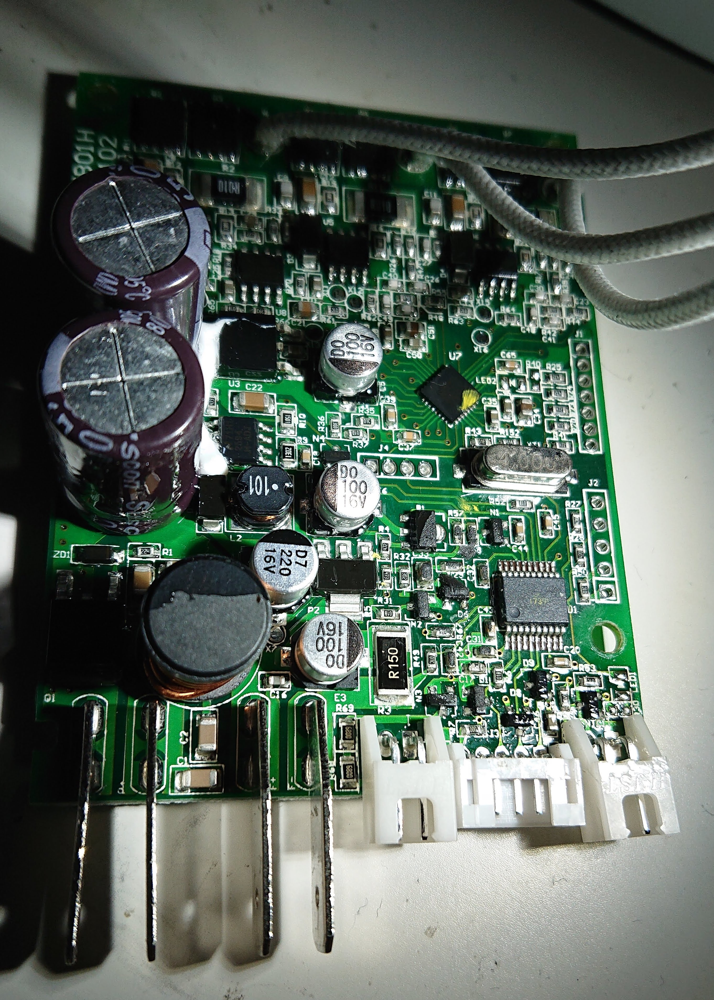

# mobicool-fr34
Alternate firmware for Mobicool FR34/FR40 compressor cooler

There are two reasons for this firmware: First I wanted to explore the possibility to run the cooler down to deep-freeze -18C temperature (as the more expensive Waeco/Dometic units can). I also wanted to be able to run the cooler on an 18V Li-Ion battery pack without the battery monitor getting all freaked out.

Mainboard top and bottom (notice the ground plane in the board easily visible by J2, not a simple 2-layer job):

Display and buttons board top and bottom:

The input is protected from reverse voltage, the 3.3V powering the logic is provided by U3, an LDO (!), yes even from 27+V as it receives when plugged into mains. There's a 12V DC/DC converter powering the cooling fan and some part of the compressor motor driver. The interior LED light is powered directly from the input voltage with a load switch and a series resistor, so intensity will vary depending on input voltage. 

PIC16F1829 pins as used on this board:

Pin | Function
--- | ---
1  VDD |
2  RA5 | TM1620B DIO through ~1k resistor (not used by this firmware, pin 3 is used for both input and output)
3  RA4 | TM1620B DIO
4  MCLR |
5  RC5 | TM1620B CLK
6  RC4 | TM1620B STB
7  RC3 AN7 | Fan current sense (150mOhm to ground)
8  RC6 AN8 | Compressor current analog input (pin 3 of mcp6002e opamp)
9  RC7 | not connected
10 RB7 | TX to IRMCF183, also connected to INT0!
11 RB6 | Output controlling a load switch (fan 12V enable from DC/DC)
12 RB5 | RX from IRMCF183
13 RB4 AN10 | Analog input (1.77V constant, likely 1.8V from IRMCF)
14 RC2 | Output controlling a load switch (12V DC/DC enable)
15 RC1 AN5 | 10k NTC input with 10k to 3v3 (cooler compartment temperature)
16 RC0 | Output controlling a load switch (MMUN2232), needs to be on for compressor to start/run
17 RA2 AN2 | Input voltage monitor (10V in == 598mV)
18 ICSP clk RA1 | (also connected to load switch for internal light)
19 ICSP dat | 
20 GND | 

The display/buttons board uses an interesting chip I've never seen before, the TM1620B from Shenzhen Titan Micro Electronics (http://www.titanmec.com/index.php/en/product/view/id/285.html) with a Chinese-language-only datasheet. Luckily it is a very straight-forward chip to program, take a look at the tm1620b.c code, where the segment mapping is also described for this particular application. 

The motor controller for the brushless DC-motor driving the compressor is an IRMCF183 - this has pre-flashed firmware inside that directly understands very primitive UART commands of 8 bytes: 0xe1, 0xeb, 0x90, motor run (1) or stop(0), then revolutions per second, 0x00, 0x00, checksum (which is a simple addition of the first 7 bytes). The response seems to be 0xe1 (only?). I couldn't find any example project from Infineon matching this packet structure, maybe someone recognizes it from somewhere else? This firmware may very well be used in other Dometic coolers using the Wancool AMV13JZ compressor. I have not tried to access the JTAG port on the IRMCF183 chip, but there's a nice space for an unpopulated connector (J1) right at the board edge :) J4 is the UART interface between PIC and IRMCF183.

This firmware was built using the MPLAB X IDE v4.20 and the free XC8 C compiler v2.00 (which worked a lot better now than the really dumb stuff Microchip had last time I used a PIC processor some 10 years ago :))

The ICSP connector (J2) is a standard pinout one where pin 1 (MCLR) being the square one. Note that the system voltage is 3.3V and the LVP program fuse most likely was disabled in the pre-programmed parts, so 9V (not 12V!) has to be applied to MCLR to program.

Here are two final images showing the remaining parts inside and the exterior:

(the leading zero in the exterior shot reveals that it is running the original firmware :))
